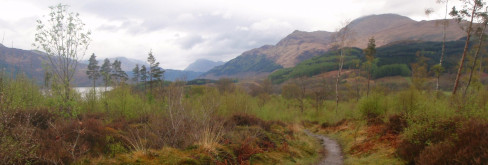

+++
menu = "main"
title = "About"
type = "about"
weight = 10
+++

<!--  -->

Rachel S. Gross is an [environmental and cultural historian](/research) of the modern U.S. and an [Assistant Professor of History](https://clas.ucdenver.edu/history/rachel-gross-0) at the [University of Colorado Denver](https://clas.ucdenver.edu/history/). In 2019 she was a Carson Fellow at the Rachel Carson Center in Munich and a [Postdoctoral Teaching, Research, and Mentoring Fellow](http://www.dhc.umt.edu/dhc-programs/trm-fellows-program.php) at the [Davidson Honors College](http://www.dhc.umt.edu/about/default.php) of the [University of Montana](http://www.umt.edu/).

She was awarded the 2018 [Herman E. Krooss Prize for Best Dissertation in Business History](http://www.thebhc.org/krooss) from the Business History Conference for her writing on the history of outdoor clothing and gear in the U.S. from the Civil War to the present.

### Partnerships and Outreach

Dr. Gross works with university and community partners to bring history into the public realm. In 2019, she curated an exhibit at the [Historical Museum at Fort Missoula](http://fortmissoulamuseum.org/) on “Outdoor Gear Stories From the Treasure State.” From January – July 2017 she served as the managing editor of [Wisconsin 101](http://www.wi101.org/), a collaborative history project that uses material culture to tell stories about Wisconsin’s past. Read a [recent post](http://www.wi101.org/objects/mepps-fishing-lure/) she edited. In 2016-2017, Dr. Gross also served on the [editorial board](http://edgeeffects.net/editorial-board/) of [Edge Effects](http://edgeeffects.net/), the digital magazine of environmental humanities of the [Center for Culture, History, and Environment](https://nelson.wisc.edu/che/index.php) in the [Nelson Institute for Environmental Studies](http://nelson.wisc.edu/).

While you’re here, you can take a look at her [writing](/writing), explore courses she's [taught](/teaching), or review her [CV](/cv). You can also follow her on [Twitter](https://twitter.com/rachelsgross).

<!--  -->