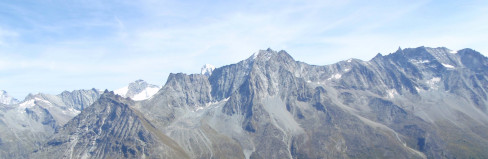

+++
menu = "main"
title = "Curriculum Vitae"
type = "curriculum-vitae"
weight = 9
+++
&#32;
#### EDUCATION

Ph.D. University of Wisconsin-Madison, 2017
M.A. University of Wisconsin-Madison, 2012
B.A. University of Puget Sound, 2008

&#32;\
&#32;
#### EMPLOYMENT

Assistant Professor of History, University of Colorado Denver, 2020 – present
Postdoctoral Teaching, Research, and Mentoring Fellow, Davidson Honors College, University of Montana, 2017 – 2019

&#32;\
&#32;
#### PUBLICATIONS
&#32;
##### Articles

“Ultralight: Commercializing Lightweight Backpacks for Long Distance Hiking,” forthcoming, _The International Journal of the History of Sport_
“Logos on Everest: Commercial Sponsorship of Expeditions, 1950-2000,” forthcoming, _Enterprise & Society_
“Layering for a Cold War: The M-1943 Combat System, Military Testing, and Clothing as Technology,” _Technology and Culture_ 60, no. 2 (April 2019): 378-408

&#32;
##### Reviews

_Heading Out: A History of American Camping_ by Terence Young, _Journal of Sport History_ 45, no. 2 (Summer 2018): 274-275
_No Más Bebés_ (dir. Renee Tajima-Peña, 2015), [_The American Historian_](http://tah.oah.org/), November 2016
_Exceptional Mountains: A Cultural History of the Pacific Northwest Volcanoes_ by O. Alan Weltzien. H-Environment, H-Net Reviews, November, 2016. https://networks.h-net.org/node/19397/reviews/154364/gross-weltzien-exceptional-mountains-cultural-history-pacific

&#32;\
&#32;
##### Other Publications

“From Buckskin to Gore-Tex: Consumption as a Path to Mastery in Twentieth-Century American Wilderness Recreation,” _Enterprise and Society_ 19, no. 4 (December 2018): 826-835

&#32;\
&#32;
#### PUBLIC HISTORY

“Outdoor Gear Stories in the Treasure State” exhibit, in partnership with the Historical Museum at Fort Missoula and the Missoula Public Library, January – April 2019
Guide and tour author, “Unseen Missoula” history tours, in partnership with the Missoula Historic Preservation Office, June 2018 – June 2019
“Pop-up Museum: Outdoor Gear,” Imagine Nation Brewing Company, Missoula, MT, December 2017
Managing editor, _Wisconsin 101_: Our History in Objects, January 2017-July 2017, www.wi101.org
Editorial board, Edge Effects digital magazine, Center for Culture, History, and Environment (CHE), UW-Madison, June 2016-May 2017, edgeeffects.net
“Trailwear/Campuswear: A Brief History of Outdoor Clothing and Gear at UW-Madison,” exhibit, Outdoor UW, Wisconsin Union, September 2014-present

&#32;\
&#32;
#### FELLOWSHIPS AND AWARDS
&#32;

Offices of Research Services, New Faculty Grant, University of Colorado Denver, 2021
Teaching Enhancement Grant, Center for Excellence in Teaching and Learning, University of Colorado Denver, 2020, 2021
Young Upwardly Mobile Professors Grant, University of Colorado Denver, 2020, 2021
Office of Research Services Travel Grant, University of Colorado Denver, 2020
[Rachel Carson Center](https://www.carsoncenter.uni-muenchen.de/index.html) Writing Fellowship, 2019
[Herman E. Krooss Prize](http://www.thebhc.org/krooss) for Best Dissertation in Business History, 2018
[Winterthur Research Fellowship](http://www.winterthur.org/?p=621), Winterthur Museum and Library, 2017
Graduate Student Travel Grant, Center for Culture, History and Environment (CHE), UW-Madison, 2016
[Samuel and Marion Merrill Graduate Student Travel Grant](http://www.oah.org/programs/awards/merrill-travel-grants/horace-samuel-marion-galbraith-merrill-travel-grant-winners/), Organization of American Historians, 2016
Research Travel Award, UW-Madison Graduate School, 2015
Dissertator Fellowship, Department of History, UW-Madison, 2015
Virginia Henry Horne Wisconsin Distinguished Graduate Fellowship, UW-Madison, 2014-2015
American Society for Environmental History Travel Grant, National Science Foundation, 2015
[Smithsonian Institution Predoctoral Fellowship](https://www.smithsonianofi.com/fellowship-opportunities/smithsonian-institution-fellowship-program/), National Museum of American History, 2014
[Lemelson Center Fellowship](http://invention.si.edu/lemelson-center-fellowship-program), National Museum of American History, Smithsonian Institution, 2014
Mellon-Wisconsin Summer Fellowship, UW-Madison, 2014
Presidents’ Graduate Student Travel Award, Pacific Coast Branch of the American Historical Association, 2014
Graduate Student Research Grant, Center for Culture, History and Environment (CHE), UW-Madison, 2014
Sloan Fellow, External Opportunities Fund, Department of History, UW-Madison, 2013
General and Mrs. Matthew B. Ridgway Research Grant, U. S. Army Military History Institute, Carlisle Barracks, Pennsylvania, 2013
Dissertator Research Travel Award, Department of History, UW-Madison, 2013
Chemical Heritage Foundation Travel Grant, Philadelphia, Pennsylvania, 2013
Hagley Exploratory Research Grant, Center for the History of Business, Technology, and Society, Hagley Museum and Library, Wilmington, Delaware, 2013
[Workshop for the History of Environment, Agriculture, Technology, and Science](http://web.sas.upenn.edu/wheats/accepted-abstracts/rachel-gross-university-of-wisconsin-madison/) (WHEATS), University of Pennsylvania, 2013
Vilas Research Travel Award, UW-Madison Graduate School, 2012
Graduate Student Research Grant, Center for Culture, History and Environment (CHE), UW-Madison, 2011
University Fellowship, UW-Madison Graduate School, 2009-2010, 2012-2013; Vilas Welcome Award, UW-Madison Graduate School, 2009
[Thomas J. Watson Fellowship](https://watson.foundation/fellowships/tj), “[Mountain Hut Systems and the Meaning of Wilderness](https://www.pugetsound.edu/news-and-events/campus-news/details/6/),” 2008-2009

&#32;\
&#32;
#### TEACHING EXPERIENCE
&#32;

##### University of Colorado Denver

Capitalism in America
Commodities and Globalization
Immigration and Ethnicity in American History
Introduction to Public History
Race and Environmental History
Survey of Feminist Thought
Women and Gender in U.S. History

&#32;
##### University of Montana

Consumer Culture in American History
National Parks and American Wilderness
Introduction to Public History
Race and Environment
U.S. Environmental HistoryCapitalism in A
Wilderness and the Outdoor Industry

&#32;

##### University of Wisconsin-Madison

History of Women and Gender in the United States since 1870
Race, Gender, and the Politics of Style

&#32;\
&#32;
#### PRESENTATIONS
&#32;
##### Invited Talks

“Selling Lifestyle, Identity, and Ethics in the 1970s Outdoor Industry,” Montana State University, Bozeman, MT, March, 2019
“Selling the Mythic Outdoorsman: How History Matters to the Modern Outdoor Industry,” Utah State University, Logan, UT, March, 2019
“Alice Holubar, Kiddie Packs, and Frostline DIY Kits: Gender and Families in the Colorado Outdoor Industry,” Museum of Boulder, Boulder, CO, March, 2019
“Outdoor Gear Stories from the Treasure State,” Montana Historical Society, Helena, MT, February, 2019
“The White Stag Over Portland: The Past and Present of Oregon’s Outdoor Gear Industry,” Oregon Historical Society, Portland, Oregon, November 2018
“From Buckskin to Gore-Tex: Consumption as a Path to Mastery in Twentieth-Century American Wilderness Recreation,” Herman E. Krooss Plenary Session for Best Dissertation in Business History, Business History Conference, April 2018
“Miracle Materials: Synthetic Fibers and the Construction of Comfort in Outdoor Recreation,” Hagley Research Seminar, Wilmington, Delaware, November 2015
“The Shop on the Way to the Wilderness: Washington’s Outdoor Industry in the Twentieth Century,” University of Puget Sound, March 2015

&#32;
##### Panels Organized

Panel Co-Organizer, “Teaching Fashion: Theory and Practice: American Studies Association,” scheduled for November, Baltimore, MD, November 2020
Panel Organizer, “Commodifying Verticality: Symbols, Systems, and Snow,” Mediating Mountains Conference, Austrian Association for American Studies, Innsbruck, Austria, November 2019
Panel Co-organizer, “Authenticity and American Material Culture,” Organization of American Historians, April 2019
Chair, Panel Organizer, “Assignment Charrette: Creative Environmental History Assignments,” American Society for Environmental History, scheduled for March 2018
Chair, Panel Co-organizer, “Better Than the Real Thing?: Synthetics and the Chemistry of Improving on Nature,” American Society for Environmental History, March 2015
Panel Organizer, “Nature, Culture, and Work: Consumption and Politics in Outdoor Labor and Leisure,” American Historical Association, January 2015

&#32;
##### Conference Presentations

“Follow the Threads: Fashion at the Crossroads of Race and Gender,” roundtable, National Council on Public History, Montreal, Canada, scheduled for March 2022
“Bringing the Outdoor Experience Indoors,” Business History Conference, March, online, 2021
“Logos on Everest: Commercial Sponsorship of American Expeditions, 1953-1990,” Mediating Mountains Conference, Austrian Association for American Studies, Innsbruck, Austria, November, 2019
“Equipment, Sponsorship, and the American Outdoor Industry,” roundtable, History of Sports Apparel and Equipment: An International Perspective, Paris, November, 2019
“Firms in the Garden: Environmental Histories of Modern Corporations,” roundtable, American Society for Environmental History, April, 2019
“Workwear, Leisurewear, and Men’s Authentic Consumption: How the Stag Cruiser Helped to Create Heritage Clothing,” Organization of American Historians, April 2019
“Mastering the Outdoors with Gore-Tex: Fabulous Fabrics and the Physiology of Comfort in Outdoor Recreation,” Thinking Mountains Interdisciplinary Summit, October 2019
“DuPont on Everest: Commercial Sponsorship of Expeditions,” American Society for Environmental History, March 2018
“Buckskin Meets Buck Skein™: The Outdoor Industry and Marketing Improvements on Nature,” Society for the History of Technology, October 2017
“Layering for the Cold with the M-1943 Field Jacket: How American Military Studies of Climates and Bodies Shaped Popular Style,” American Society for Environmental History, March 2017
“Outdoor Recreation and Counterculture: An Alternative Consumer Society?” Organization of American Historians, April 2016
“Miracle Fibers?: The New Synthetic Tradition in the Outdoors,” American Society for Environmental History, March 2015
“‘An Adverse Effect on Nature’: Outdoor Recreation and the Lament of the Gearmaker,” American Historical Association, January 2015
“Greening Outdoor Recreation in the Age of Plastics,” Green Capitalism? Conference, Hagley Museum and Library, Wilmington, DE, October 2014
“How Outdoor Clothing Became Fashion: Do-It-Yourself Kits and the Outdoor Lifestyle Industry in the 1960s and 1970s,” Pacific Coast Branch of the American Historical Association,” August 2014
“Purchasing the Primitive: DIY Kits and the New Craftsmen of the Outdoors,” German Historical Institute, Washington, D.C., Workshop on “A Hands-on Approach: The Do-It-Yourself Culture and Economy in the Twentieth Century,” April 2014
“Synthetic Wilderness: Gore-Tex and the Path to Mastery in Outdoor Recreation,” Organization of American Historians, April 2014
“Heritage Fashion: The Imagined History of American Labor in Contemporary Clothing,” Program in Gender and Women’s History Graduate Student Conference, UW-Madison, February 2014
Roundtable on Vernacular Architecture and Environmental History, Panelist, Vernacular Architecture Forum, Madison, WI, June 2012

&#32;
##### Campus, Departmental, and Academic Talks

“A Gendered History of the Outdoor Industry from Buckskin to Bean Boots,” Women and Gender Studies Colloquium, CU Denver, March 5, 2021
“Gore-Tex and Smart Wool: Weighing the Costs of the Synthetic Wilderness,” Max Planck Institute for the History of Science, Berlin, December 2019
“From Workwear to Miracle Materials: The Outdoor Industry in American History,” Lunchtime Colloquium, Rachel Carson Center, Munich, July 2019
“The Khaki Gang: Army Surplus in Postwar America,” Lockridge History Workshop, University of Montana, January 2018
“‘Where the Blazed Trail Crosses the Boulevard’: Abercrombie & Fitch and the Origins of the American Outdoor Industry,” Davidson Honors College Faculty Lecture Series, University of Montana, December 2017
“From Buckskin to Gore-Tex: Inventions and Innovation in Outdoor Gear,” Blackstone LaunchPad, University of Montana, October 2017
“Wear a Hat to Keep Your Feet Warm, and Other Lessons from the Science of Dressing during World War II,” History of Science Brown Bag Series, UW-Madison, January 2017
“What Retreating to the Canadian North Woods Tells Us About Nature and Ourselves,” film introduction at Tales for Planet Earth Environmental Film Festival, Madison, WI, 2015
“‘How to Enjoy Backpacking’: Gerry Cunningham and the New Primitive in Postwar Outdoor Recreation,” Program in Gender and Women’s History, UW-Madison, Graduate Student Panel, 2013
“‘Like a Real Cowpuncher’: Stetson Hats and Western Masculinity, 1865-1900,” North American Landscapes, Regions, and Peoples: A Research Symposium, UW-Madison, 2010
“The Search for Dharma,” Commencement Speaker, University of Puget Sound Commencement, 2008

&#32;\
&#32;
#### UNIVERSITY SERVICE
&#32;

Scholarship Selection Committee, Foster, Koch, Coulter, and Ward scholarships, Department of History, University of Colorado Denver, 2020
Selection Committee, Postdoctoral Teaching, Research, and Mentoring Fellowship, Davidson Honors College, University of Montana 2018, 2019
Selection Committee, Presidential Leadership Scholarship, Davidson Honors College, University of Montana, 2018, 2019
Organizer, History Department Colloquium, UW-Madison, 2015-2016
Programming Committee, Tales for Planet Earth Environmental Film Festival, 2015
Organizer, BrunCHÉ (monthly graduate student research presentations), Center for Culture, History, and Environment (CHE), UW-Madison, 2014-2015
Graduate Council, Department of History, 2014-2016
Steering Group, Anthropocene Slam: Environmental Futures, Center for Culture, History, and Environment (CHE), UW-Madison, 2014
Panelist, New Graduate Student Orientation, Department of History, UW-Madison, 2014, 2016
Planning Committee, Material Bodies/Contested Fantasies: Program for Gender and Women’s History Graduate Student Conference, UW-Madison, 2013
Review Committee, Vilas Research Travel Award, UW-Madison Graduate School, 2013
UW-Madison Teaching Academy, Future Faculty Partner, inducted 2013
Graduate Student-Faculty Liaison Committee for the Allan H. Selig Chair in U.S. Sport and Society, Department of History, UW-Madison, 2013
Joint Committee on Teaching Assistants, Department of History, UW-Madison, 2012-2014
Harassment and Discrimination Committee, Department of History, UW-Madison, 2011-2014
Planning Committee, Center for Culture, History, and Environment (CHE) Graduate Student Symposium, UW-Madison, 2010, 2011, 2012, 2013, 2016
Panelist, Teaching Assistant Diversity Training, Department of History, UW-Madison, November 2012
Panelist, MA/Prelims Workshop, Department of History, UW-Madison, September 2012
Panelist, New Teaching Assistants Orientation and Training, Department of History, UW-Madison, August and October 2012
Graduate Student Secretary, CHE, UW-Madison, Fall 2011-Spring 2012
Organizing Committee, CHE Place-Based Workshop, “Landscapes of Health,” UW-Madison, May 2011
Graduate Student Representative, CHE Executive Committee, UW-Madison, Fall 2010-Spring 2011
Graduate Student Mentor, Department of History, UW-Madison, 2010-2011

&#32;\
&#32;
#### COMMUNITY ENGAGEMENT
&#32;

Panel chair, “Beyond ROI: Historians on Creating Analysis from Archives,” Utah State University, September 15, 2021
“The Outdoor Industry in Colorado in Three Objects,” Westerners History group, May 13, 2021
Guest speaker on “Outdoor Archive,” RANGE consulting panel, April 15, 2021
Guest speaker on “Big Box Retail and the Outdoor Industry,” Plato Institute class on “Consumption: From Wedgewood to Walmart,” March 4, 2021
“The Gear in Your Pack: A History of the Outdoor Industry in Colorado,” Aurora History Museum, February 17, Aurora, CO, 2021
Guest editor of student work, National History Day Journal, 2020, 2021
National History Day Judge, Colorado, 2020
“Gallery Talk: Outdoor Gear Stories from the Treasure State,” Historical Museum at Fort Missoula, March 10, Missoula, MT, 2019
“Outdoor Gear Stories From the Treasure State,” Missoula Public Library, September 2018
“Packboards, Fishnet Underwear, and Iron Skillets: Missoulians and the History of Outdoor Gear,” Osher Lifelong Learning Institute at UM, May 2018
“Synthetic Wilderness: How the History of Outdoor Clothing and Gear Shapes Outdoor Recreation Today,” Rocky Mountaineers club meeting, April 2018
“Women in Wilderness,” University of Montana Wilderness Association, April 2018
“Packboards, Fishnet Underwear, and Iron Skillets: Missoulians and the History of Outdoor Gear,” Historical Museum at Fort Missoula, April 2018

&#32;\
&#32;
#### PROFESSIONAL ACTIVITIES
&#32;

Article Reviewer, Environmental History, Business History Review
Graduate Student Liaison, American Society for Environmental History, 2016
Education Committee, American Society for Environmental History, 2015-2018
Editorial board, The American Historian, Organization of American Historians magazine, 2014-2016
Planning Committee, Graduate Student Writing Workshop, Graduate Student Caucus for the American Society for Environmental History, 2013-2014

&#32;\
&#32;
#### PROFESSIONAL ORGANIZATIONS
&#32;

American Historical Association
Organization of American Historians
American Society for Environmental History
Business History Conference 


_updated July 2021_
<!--  -->