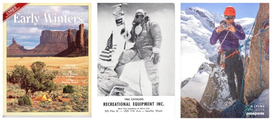
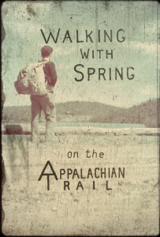

+++
title = "Writing"
+++

Pause for a moment to read and ponder about the next time you explore the great outdoors.

<!--more-->

##### **Digital Publications**

“[A Historian Gets Fact-Checked](https://connections.cu.edu/stories/cu-faculty-voices-historian-gets-fact-checked),” CU Faculty Voices, 2021
“Tool Users: Insulated Sleeping Bags,” _Alpinist Magazine_, March 2021
“[Sold Out!: Outdoor Rec in a Disaster Year](https://www.historycolorado.org/story/hindsight-2020/2021/01/15/sold-out-outdoor-rec-disaster-year),” _The Colorado Magazine_, History Colorado, February 2021
“[Bob Gore’s Cozy Revolution](https://www.sciencehistory.org/distillations/bob-gores-cozy-revolution),” _Distillations_, December 2020
“[Equipment for the Family Outdoors: Margaret Hansson’s Kiddie Carrier](https://www.historycolorado.org/story/2020/07/08/equipment-family-outdoors),” History Colorado Blog, July 2020
“[The Military Origins of Layering](https://www.theatlantic.com/technology/archive/2019/09/how-military-science-popularized-layered-clothing/597577/),” _The Atlantic_, September 2019
“[How a $750 Down Jacket is Dividing College Campuses](http://edgeeffects.net/canada-goose/),” Edge Effects, December 2017
“[A Syllabus for Contextualizing Energy Policy Debates](http://edgeeffects.net/energy-syllabus/),” with Brian Hamilton, Edge Effects, January 2017
[Review of Exceptional Mountains: A Cultural History of Pacific Northwest Volcanoes](https://networks.h-net.org/node/19397/reviews/154364/gross-weltzien-exceptional-mountains-cultural-history-pacific), November 2016
“[Marketing America’s Best Idea: From the National Parks Portfolio to #FindYourPark](http://historynewsnetwork.org/article/163733),” History News Network, August 2016
“[The Surprise that REI is Closing on Black Friday Shouldn’t Really Be a Surprise at all](http://historynewsnetwork.org/article/161308),” History News Network, November 2015
“[The Case of the Insulated Underwear: Dacron and DuPont Brand Awareness](http://www.hagley.org/librarynews/case-insulated-underwear-dacron-and-dupont-brand-awareness),” Hagley Library blog, March 2014
“[20th Century Camping with Abercrombie and Fitch](http://americanhistory.si.edu/blog/2014/05/camping-with-the-historical-abercrombie-fitch-catalog.html),” _O Say Can You See_, Smithsonian National Museum of American History blog, May 2014
“[How to Read an Outdoor Catalog](http://edgeeffects.net/help-ive-got-gas/),” Edge Effects, November 2014


&#32;
&#32;\
&#32;\

“[Trail Tradition: When Hikers Shun Innovation](http://si-siris.blogspot.com/2014/05/trail-tradition-when-hikers-shun.html),” Smithsonian Institution Collections blog, May 2014

